# Accounts and Downloads
- **This is the Downloads and Accounts setup document!**
- **Make sure to install these applications before starting the course!**

## Downloads - How To Videos:

- **Windows Users: [http://vimeo.com/user/70065133/folder/2218955](http://vimeo.com/user/70065133/folder/2218955)**

- **Mac Users: [http://vimeo.com/user/70065133/folder/2225504](http://vimeo.com/user/70065133/folder/2225504)**

# **Accounts:**

During this course, you'll be using a few different online tools. Let's get some accounts setup:
* Create a[ GitHub Account](https://github.com/)
* Create a [Heroku Account](https://dashboard.heroku.com/apps)
* Create a[ Codewars Account](https://www.codewars.com/)

 
* Set your Codewars Clan to (cAsE-sEnSiTiVe): TrueCoders

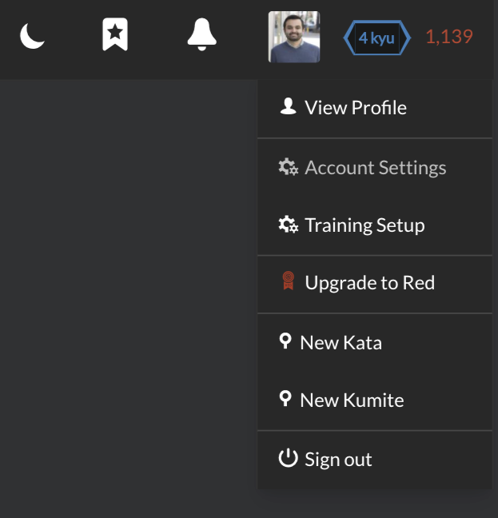

* Create a [Sololearn.com](https://www.sololearn.com/) Account
* Create a[ freeCodeCamp Account](https://www.freecodecamp.org/)
* Create a [www.npmjs.com](https://www.npmjs.com/) Account
* Accept the invitation to our Discord Channel if you haven’t already! You can find the invitation in your email from TrueCoders.

# **Downloads:**

### **INSTALLING Node.js:**
- **Go to [https://nodejs.org/en/](https://nodejs.org/en/) and install “LTS” for your OS!**
- **Installing Node.js will also give us npm and with the newest npm version, we also get npx! We will learn and use both of these**

<table>
  <tr>
   <td>

[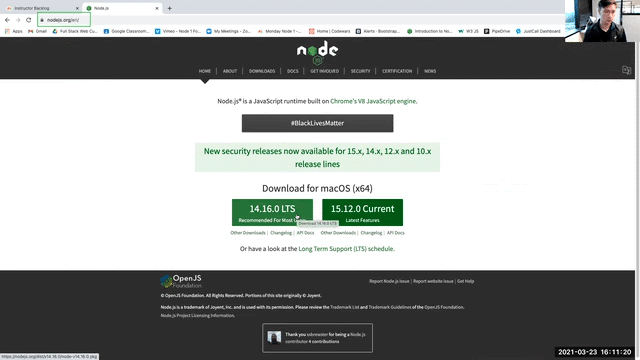](https://vimeo.com/528028270/a339e72dc1)

   </td>
   <td>

[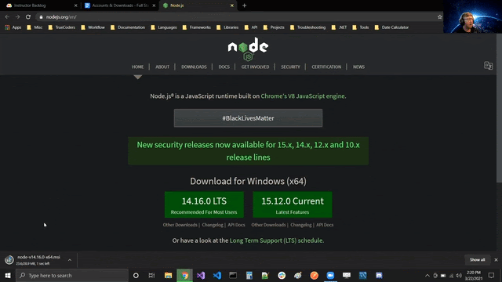](https://vimeo.com/527529715/3df2102910)

   </td>
  </tr>
  <tr>
   <td>Click the gif above  to view the Mac walkthrough
   </td>
   <td>Click the gif above to view the Windows Walkthrough
   </td>
  </tr>
</table>

## - **Download Visual Studio Code: [https://code.visualstudio.com/download](https://code.visualstudio.com/download)**

<table>
  <tr>
   <td>

[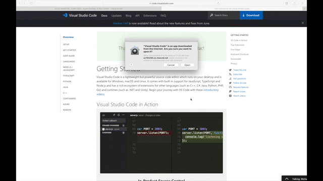](https://vimeo.com/439024695/5852860f0a)

   </td>
   <td>

   </td>
  </tr>
  <tr>
   <td>Click the gif above  to view the Mac walkthrough
   </td>
   <td>Click the gif above to view the Windows Walkthrough
   </td>
  </tr>
</table>

- ## Download **Google Chrome**: [https://www.google.com/chrome/](https://www.google.com/chrome/)
- ## Download **Git**:[ https://git-scm.com](https://git-scm.com)

### **_Throughout the installation, keep all defaults selected_**

<table>
  <tr>
   <td>

[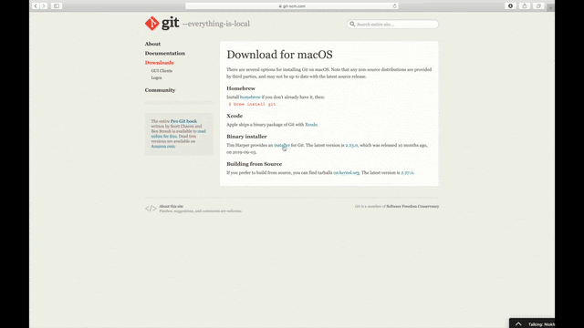](https://vimeo.com/439025092/78b8bec674)

   </td>
   <td>

[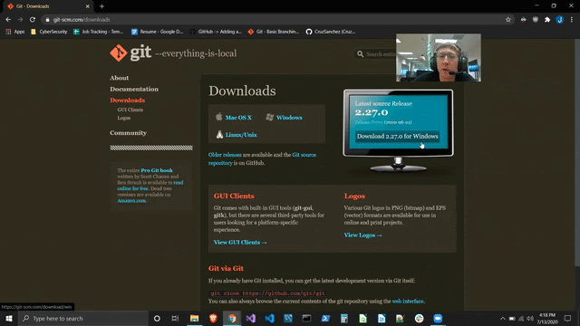](https://vimeo.com/438678226/b40acefb43)

   </td>
  </tr>
  <tr>
   <td>Click the gif above  to view the Mac walkthrough
   </td>
   <td>Click the gif above to view the Windows Walkthrough
   </td>
  </tr>
</table>

___

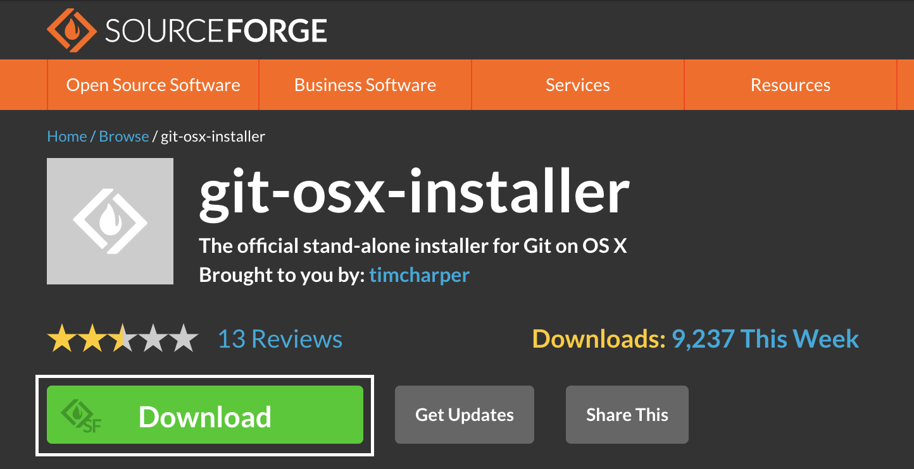

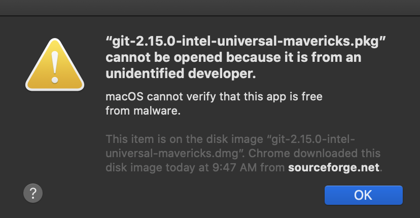

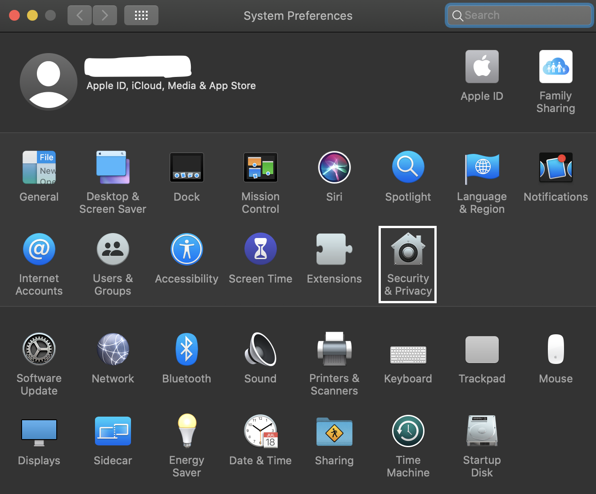

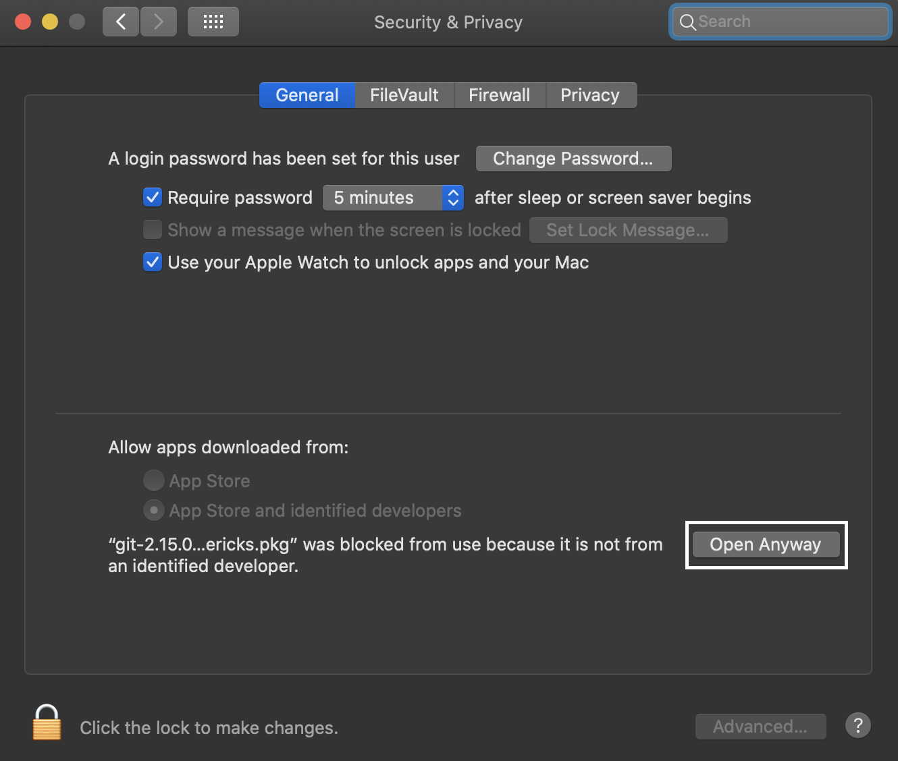

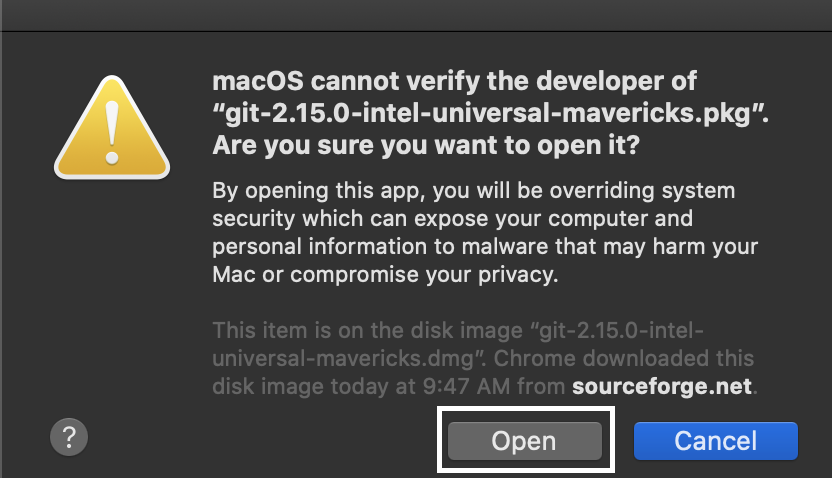

- ## **Download MySqlWorkBench**: 

Mac and Windows will be different:

**IF AT ANY POINT IT WANTS YOU TO SET A PASSWORD, USE THE WORD password**

<table>
  <tr>
   <td>

[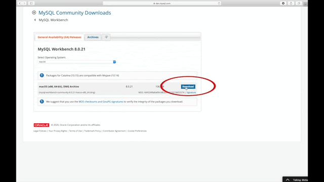](https://vimeo.com/439025021/0c442083b0)

   </td>
   <td>

   </td>
  </tr>
  <tr>
   <td>Click the gif above  to view the Mac walkthrough for Workbench
   </td>
   <td>Click the gif above to view the Mac walkthrough for Server
   </td>
  </tr>
</table>

[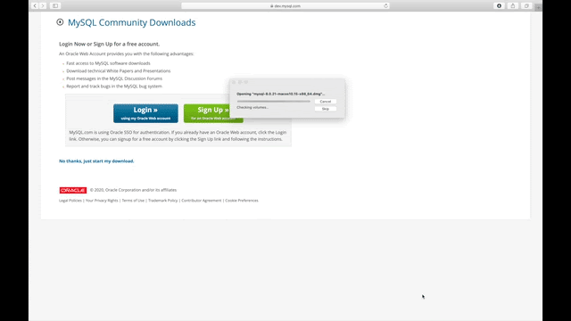](https://vimeo.com/444971493/2b0def4e55)

**Click the gif above to view the Windows Walkthrough for both mySQL Workbench and Server**

- ## **For Mac**, follow these steps:
    * Download MySql WorkBench:
        * [https://dev.mysql.com/downloads/workbench/](https://dev.mysql.com/downloads/workbench/)
    * Download MySql Server:
        * [https://dev.mysql.com/downloads/mysql/](https://dev.mysql.com/downloads/mysql/)
    * If mac prevents you from installing:
        * Open system preferences -> security -> open anyway
    * If your server is not running:
    * Open System Preferences:

### Click MySQL

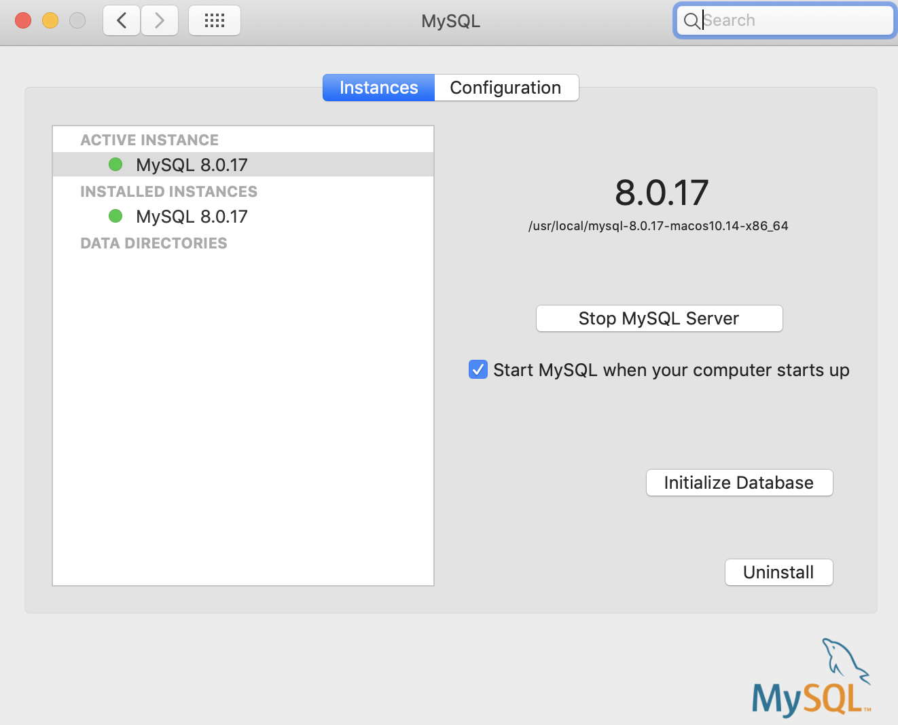

- ## **For Windows**, follow these steps:
* Go to [https://dev.mysql.com/downloads/windows/installer/8.0.html](https://dev.mysql.com/downloads/windows/installer/8.0.html)

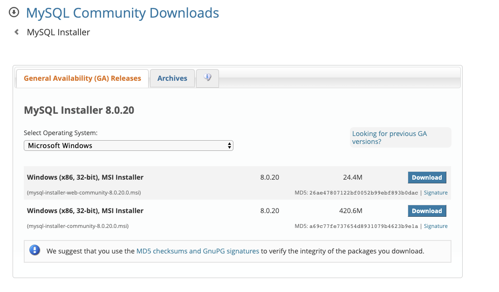 

* Then click the download button on the larger file, which will take you to the next page where you need to click “**[No thanks, just start my download.](https://dev.mysql.com/get/Downloads/MySQLInstaller/mysql-installer-community-8.0.19.0.msi)**”
* Once the download has finished, it will open up to this window, BE SURE to select Custom and then click Next!

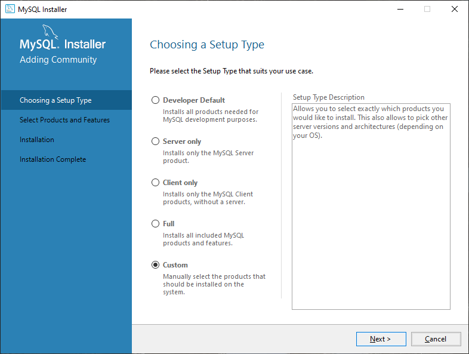

* The next step you will need to move over the items you want to install. This will include **Workbench**, **Server** and **Shell**. Do this by opening up the MySql Server folder completely and then click the green arrow. Then do the same thing under applications moving over Workbench and Then Shell: 

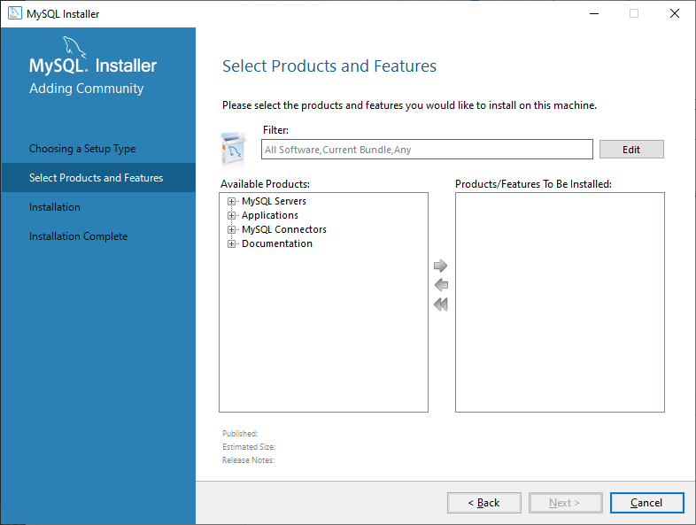

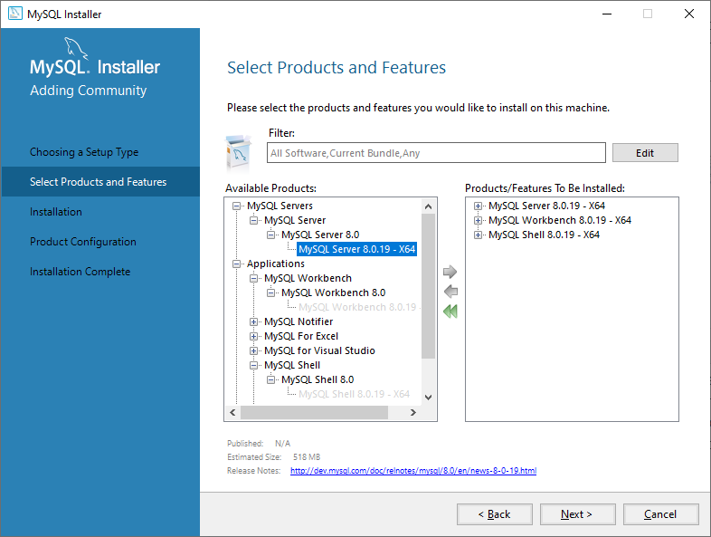

* Then click **Next**
* Then click **Execute**

Once the install is finished, you will be prompted to configure your server:

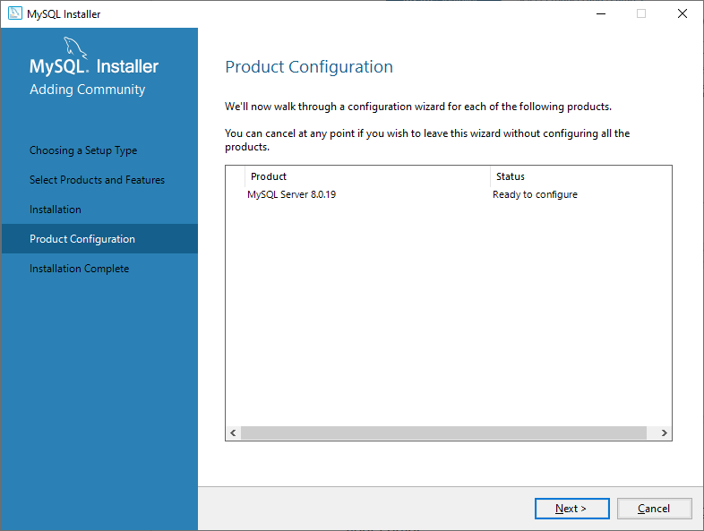

- Be sure to select Standalone Server:

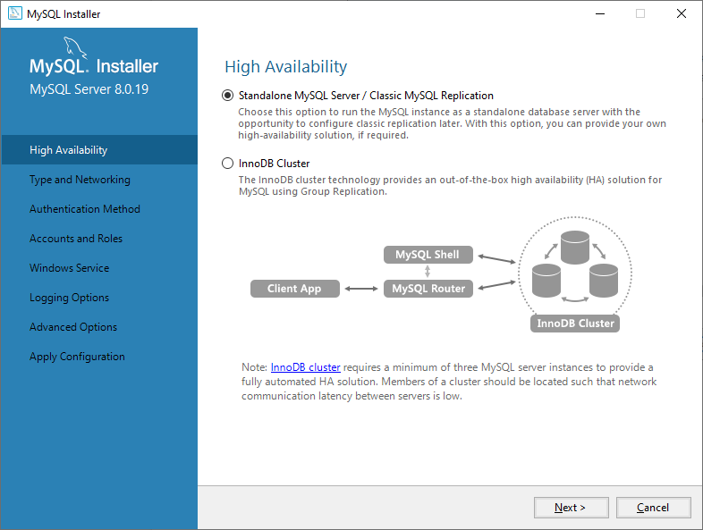

- Then be sure to mimic these settings:

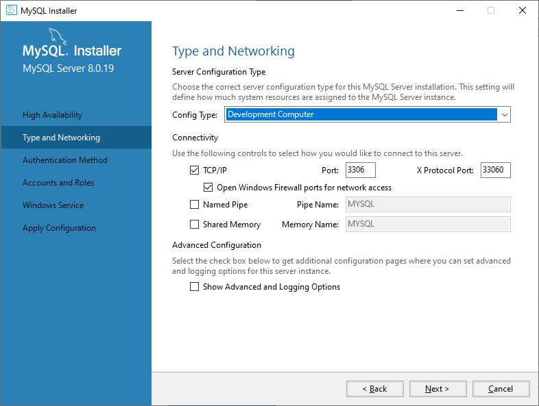

- After clicking Next, be sure to select the recommended password setting!

- ## **MAKE YOUR PASSWORD: “password”**

- Click **Next**
- Then **Next** again.
- Then click **Execute**

When finished, open MySQL Workbench and your setup should look like this:

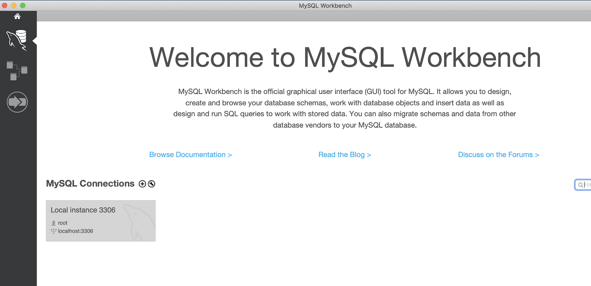

If you need to reset your Server password, try reinstalling MySQL Server or use this link:

- ## [https://dev.mysql.com/doc/refman/8.0/en/resetting-permissions.html](https://dev.mysql.com/doc/refman/8.0/en/resetting-permissions.html)

- ## Download the BestBuy database: [https://drive.google.com/file/d/1JK7j9pREUf5r2OHGO_b8B2n0JyWLmMLz/view?usp=sharing](https://drive.google.com/file/d/1JK7j9pREUf5r2OHGO_b8B2n0JyWLmMLz/view?usp=sharing)

- Save it to your computer, open MySqlWorkBench:

- Once MySQL Workbench opens a local instance… Click File then click Open SQL Script:

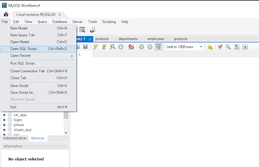

- Select the Best Buy Sql file

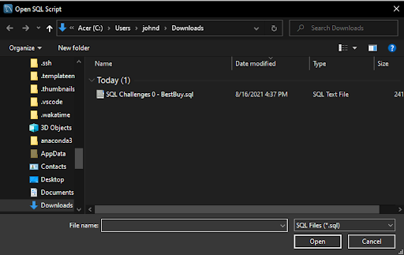

- Then click the lightning bolt:

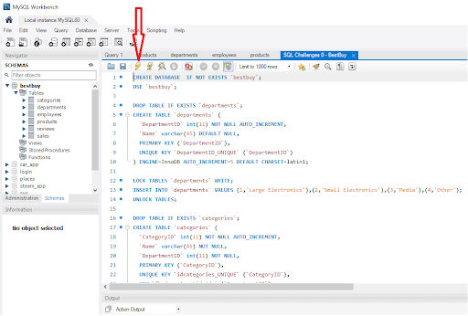

- Once MySQL finishes running the script, click the Schemas tab (red arrow)  and then click the refresh button (black arrow) to see your Bestbuy DB:

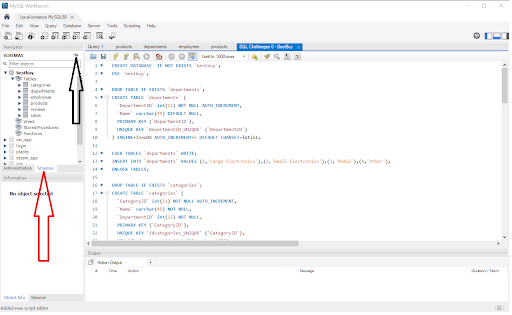

If everything is working correctly, you are now finished! Congrats!

