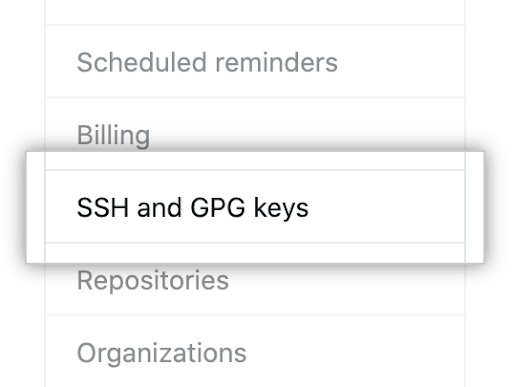

# Windows SSH Key instructions

Next we need to generate an SSH Key to authenticate our connection to GitHub. Copy the text below and paste it in the _git bash_

* ssh-keygen -t ed25519 -C "_[your_email@example.com](mailto:your_email@example.com)_"

    1. Note that you’ll need to replace “[your_email@example.com](mailto:your_email@example.com)” with your email that you used to create your github account.
* At the prompt below, type a secure passphrase.

    2. > Enter passphrase (empty for no passphrase): _[Type a passphrase]_
    3. > Enter same passphrase again: _[Type passphrase again]_
* When you're prompted to "Enter a file in which to save the key," press Enter. This accepts the default file location.
* Next, let's start the ssh-agent in the background. Paste the first line below in the terminal, the second line is what you’re expecting the terminal to say back to you.

    4. eval `ssh-agent -s`
    5. Agent pid 59566
* Add your SSH private key to the ssh-agent. If you created your key with a different name, or if you are adding an existing key that has a different name, replace id_ed25519 in the command with the name of your private key file.

* **ssh-add ~/.ssh/id_ed25519**

Now we need to get our newly generated SSH connected to our GitHub account.

* Copy the SSH public key from your terminal. Paste the code below in your terminal, and it’ll copy the SSH Key. 

* **~/.ssh/id_ed25519.pub**

6. Tip: If clip isn't working, you can locate the hidden .ssh folder, open the file in your favorite text editor, and copy it to your clipboard.
* Go to [GitHub](https://github.com/). In the upper-right corner of any page, click your profile photo, then click Settings. 

* In the user settings sidebar, click SSH and GPG keys. 

*   Click New SSH key or Add SSH key. 

* In the "Title" field, add a descriptive label for the new key.
* Paste your key into the "Key" field. 

* Click Add SSH key. 

* If prompted, confirm your GitHub password. 

