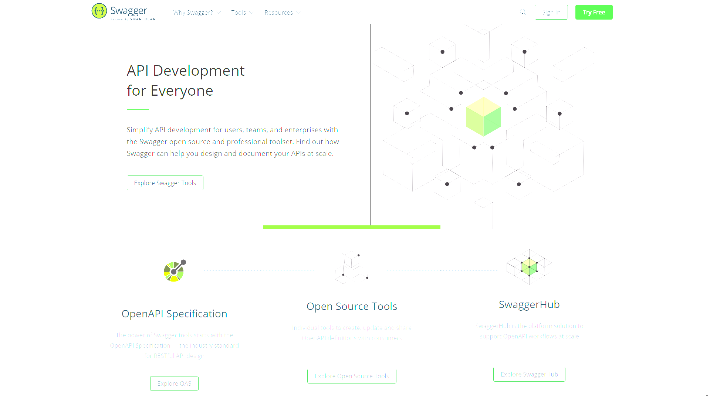

# Create Your Own API
## Objective
* Create your own API that queries a database and returns information depending on the data requested

## Steps
1. Create a new project folder
2. Initialize npm in your project
3. Create a new folder named “server”
    * This is where you will initialize a new Express application, create your api endpoints, and query your database
4. Create a new folder named “db”
    * This is where you will create your query model and query functions to be used in your application
5. You will need to create a database with tables in MySQL Workbench to store your data
    * You can use dummy data (could potentially be a funny api), or real information about something you like
6. At a minimum, your api should start with GET, POST, PUT, and DELETE endpoints for a specific set of data (characters, topics, categories, prices, etc)
    * GET returns a list of characters
    * POST inserts a new character to the database
    * PUT updates an existing character in the database
    * DELETE removes an existing character from the database
7. Have a table in your database that stores information about each request
8. Create a GET endpoint for viewing the requests made to your server
9. Make sure to account for errors with try/catch blocks
10. Create a catch all middleware that acts as a custom error handler for your application
11. Be sure to account for 404 not found responses

## Extra
* Now that you’re on your way to creating your very own api, you should write documentation for others to use it too!
* Practice your markdown skills to create your very own API documentation
* You can either write your own or use something like [Swagger](https://swagger.io/)

